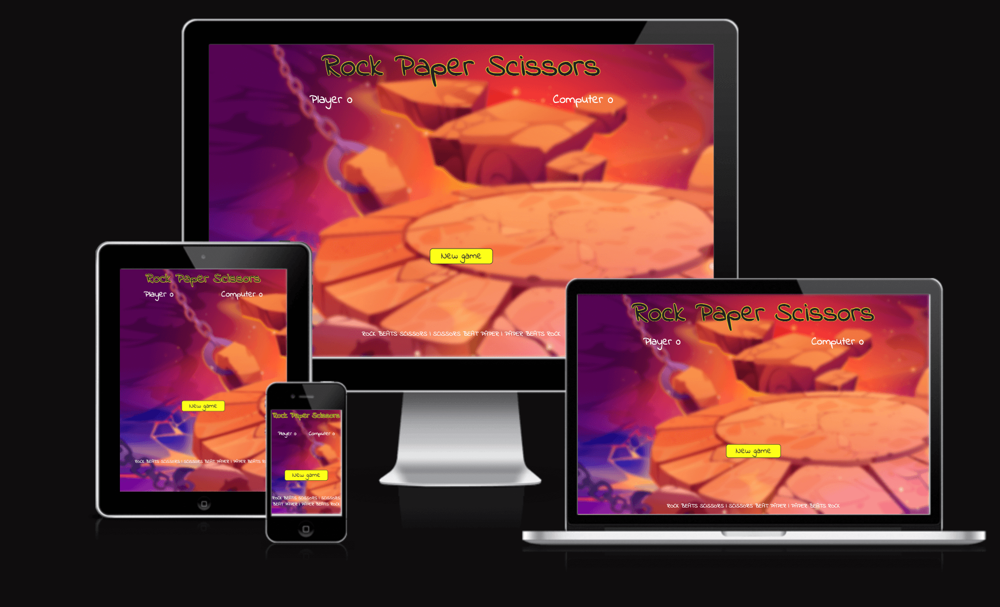
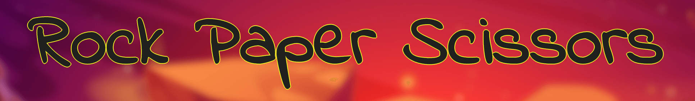
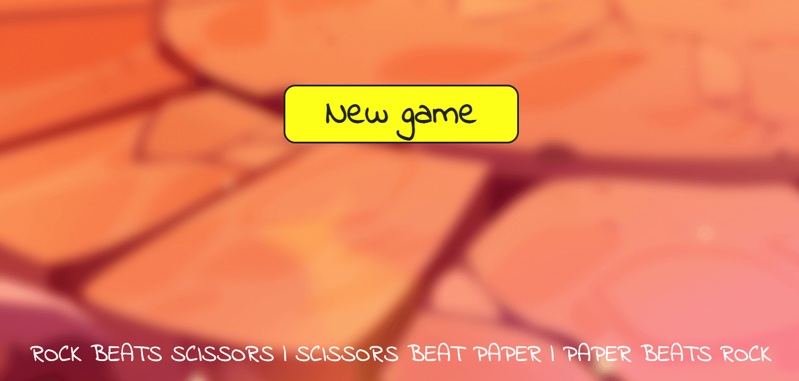
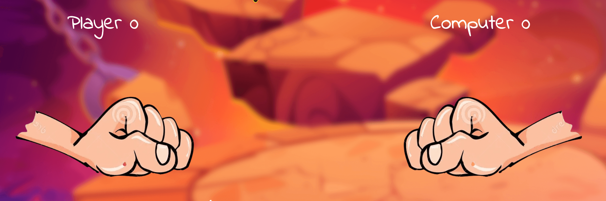
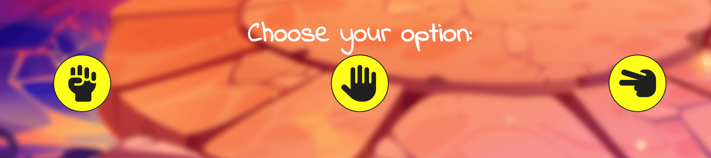
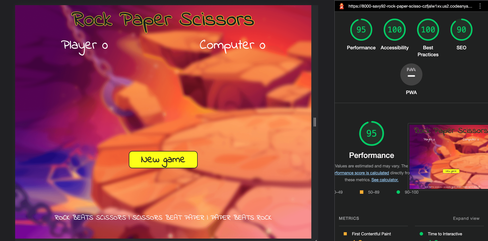

# Rock, Paper, Scissors

## Introduction

Welcome to my first interactive game site. My take on the beloved 100+ year old game provides users with an interactive version in which has been designed to be responsive and accessible on all device platform.

Whether users want to just engage for a mental challenge, compete on the scoreboards or just have a little bit of fun. The website is designed to provide users with a clear and easy to navigate interface with clean and correct javascript to allow the game to run smoothly.

## User Experience (UX)

### User Stories

#### First Time Visitor Goals

- As a first time visitor, I want to easily understand the main purpose of the site and learn more about how it works and what it offers.
- As a first time visitor, I want to quickly determine if the site is relevant for my needs.
- As a first time visitor, i want to be able to play on any device and from anywhere.
- As a first time visitor, I want to be able to easily navigate throughout the site.
- As a first time visitor, I want to interact with the game without and delays or lag.

#### Returning Or Frequent Visitor Goals

- As a returning user, I want the game to run smoothly without disruptions.
- As a returning user, I want to continue to build on my score.

## Design

### Colour Scheme

The two main colours used are white & black for the text. Simply because both colours on a background image provides the highest readability. I have also introduced a yellow border around the black colour in to really make the title of the game stand out.

### Typography

The Indie Flower font is the main font used throughout the whole website with Sans Serif as the fallback font in case for any reason the font isn't being imported into the site correctly. The Indie Flower font is picked as it feels carefree which is how you want to feel when playing a game and inviting with the bubbly, rounded edges. It is also easy to read and a bit bolder then the majority of fonts i looked into.

### Imagery

The background image was designed to capture the users attention whilst also showing the purpose of the website. It has a gaming feel to the image which the user's can relate to, as a majority of games include similar images. A backdrop filter was added to blur the image just enough to make the actual text and game stand out. Font Awesome was used for the option buttons to give a better visual effect to the game, instead of using plain text. It is clear and easy to see, for better user interaction.

## Features

### Header

- Featured at the top of the page, the header shows the game name in the Indie Flower font which is bold and playful. It is clear visible when entering the web-page.

- it is straight to the point and lets the user know exactly what game they will be interacting with.

### New game button / Rules

- located in the middle of the page is a New game button which was created with a yellow background and black text font. The contrast allows the user to easily read the text and the 20% of the yellow colour used around the website gives the user an indication of what the interaction features are. Just like a majorit of games that exist's the yellow colour indicates some sort of checkpoint or action button. When the New game button is clicked, the introduction page will fade into the game.

- The rules are located near the buttom of the screen and simply shows the user how the game works.

### Players score / Main hand-images

- The players scores are located just underneath the title when the game fades in. The font is big and the score is clear, which allows the users to know what the scores are whilst playing the game.

- The main imge hands adds a sense of fun to the game, as the image will change depending on what the player picks as their options and the computers option making the game using to play.

### The game options

- The games options include a clear instruction with a choice of options to choose from: Rock, Paper & Scissors.

- The options are interactive which the user can click to make their choice.

- The buttons colours carry over the same style from the New game button, keeping it consitant and never leaves the user second guessing on as yellow colour again indicates the interactive buttons.

- The 'Choose your option:' text changes depending on if the user wins the round it will output 'You win!, if the user loses the won it will output 'You lost this round! and if it's a draw it will simply output 'It is a draw!'. Keeping the user up to date with the outcome as they interact with the game.

## Technologies Used

### Languages Used

- HTML5
- CSS3
- JavaScript

### Tools Used

- Devtools
- Google Fonts
- Font Awesome
- Mycolor.space
- Freepik.com
- Dreamstime.com
- Git was used for version control by utilizing the Gitpod terminal to commit to Git and Push to GitHub.
- GitHub
- GitHub is used to store the projects code after being pushed from Git.

## Testing

The W3C Markup Validator, W3C CSS Validator & JSHint JavaScript Validator Services were used to validate every page of the project to ensure there were no syntax errors in the project.

### Further Testing

- Tests were done to make sure the website worked smoothly in different browsers (Google Chrome, Internet Explorer, Microsoft Edge and Safari.)
- Devtools were used to verify that the website is responsive on different viewports.
- Tests were done to ensure the game was operating correctly.

## Deployment

### GitHub Pages

The project was deployed to GitHub Pages using the following steps...

1. Log in to GitHub and locate the GitHub Repository
2. At the top of the Repository (not top of page), locate the "Settings" Button on the menu.
3. Scroll down the Settings page until you locate the "GitHub Pages" Section.
4. Under "Source", click the dropdown called "None" and select "Master Branch".
5. The page will automatically refresh.
6. Scroll back down through the page to locate the now published site link in the "GitHub Pages" section.

The development environment used for this project was CodeAnywhere. To track the development stage and handle version control regular commits and pushes to GitHub has been conducted.

## Credits

- Google fonts were used to import the 'Indie Flower' font into the style.css file which is used on all sections throughout the project.
- stackoverflow / w3schools / css-tricks - for developing my knowledge.
- Font Awesome was used for the option buttons to give rock, paper and scissors icons.
- Mycolor.space - used to choose the colours for the buttons.
- Freepik.com - used to download the backgound image.
- Dreamstime.com - used to download the hand animations.

## Content

All content was written by the developer.

## Acknowledgements

My Mentor for continuous helpful feedback. The slack community for all there advice and guidance.
